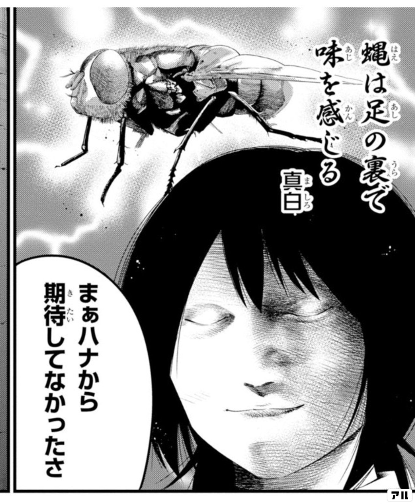
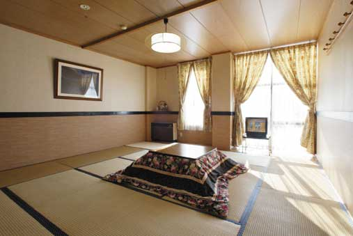

# スキー旅行計画

## 日程
- 2025年2月14日(土) 

    越後湯沢駅に集合、バスから宿へ　荷物置いたのちスキー　宿に戻る　飯はどこかで食べる？
    
    扉参加賞、十二星座19(野良)or20(ギルドPT)、天空神輿
- 2025年2月15日(日)
    
    一日中スキーするぞ！わくわくてかてか
    
    博学者、じゃがいも英傑、異変制裁、DD、グロ霧等週イベここまでに完走
- 2025年2月16日(月)

    まだスキーするぞ！越後湯沢駅に戻り解散。

    エースライダー、ギルド舞踏会

## メンバー
|名前|年齢|ふるさと納税の使い道|
|---|---|---|
|小山雪之丞|27|ゼリー|
|柳町皐太|26|肉・干し芋|
|石原篤|26|月の土地|
|石橋リョウ|23?|手コキ屋さん|
|上野タロウ|23?|米|

## スキー場
石内丸山、ガーラ湯沢、湯沢高原スキー場の三山が繋がっている  
[湯沢スノーリンク](https://www.yuzawasnowlink.com/winter/)

## 宿  
### [雪と蛍の舞う宿　ミストラル](https://r.goope.jp/mistral/)

泊まる部屋

## 飯
夕食

