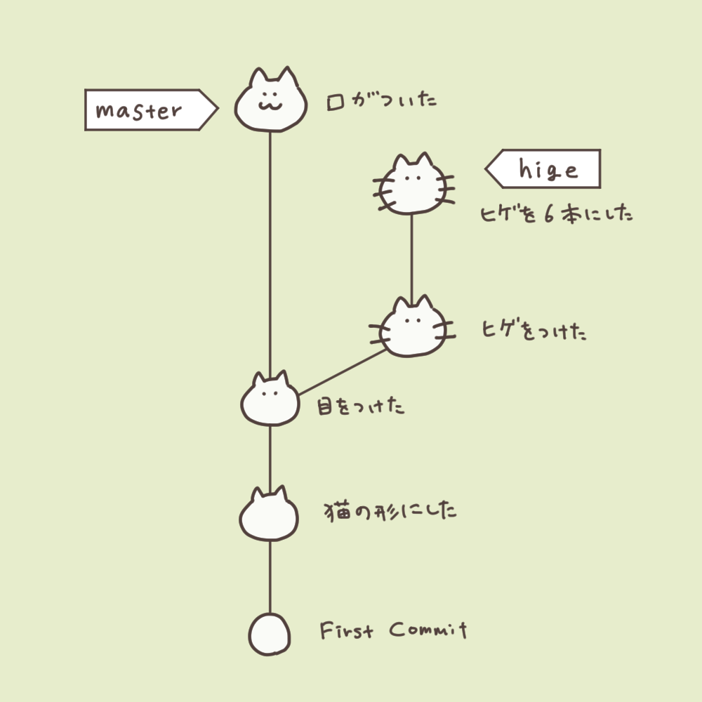
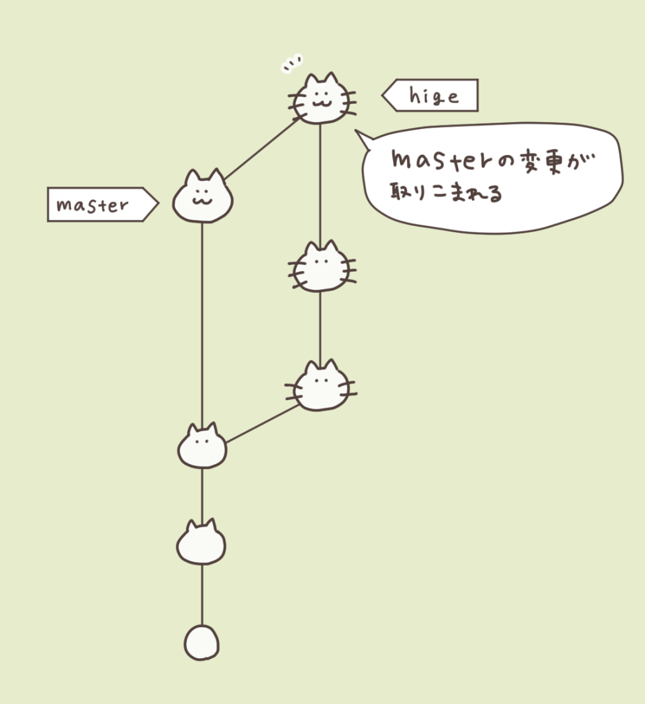
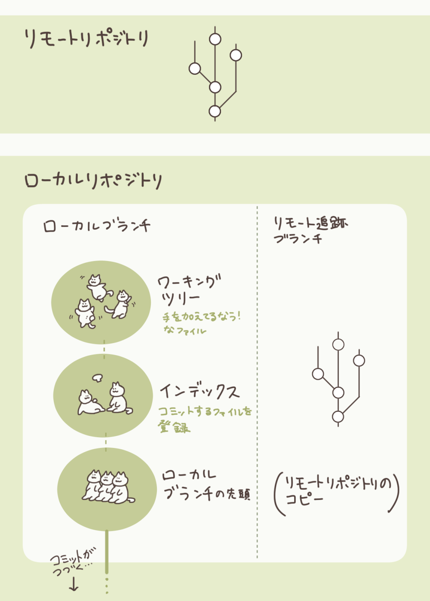
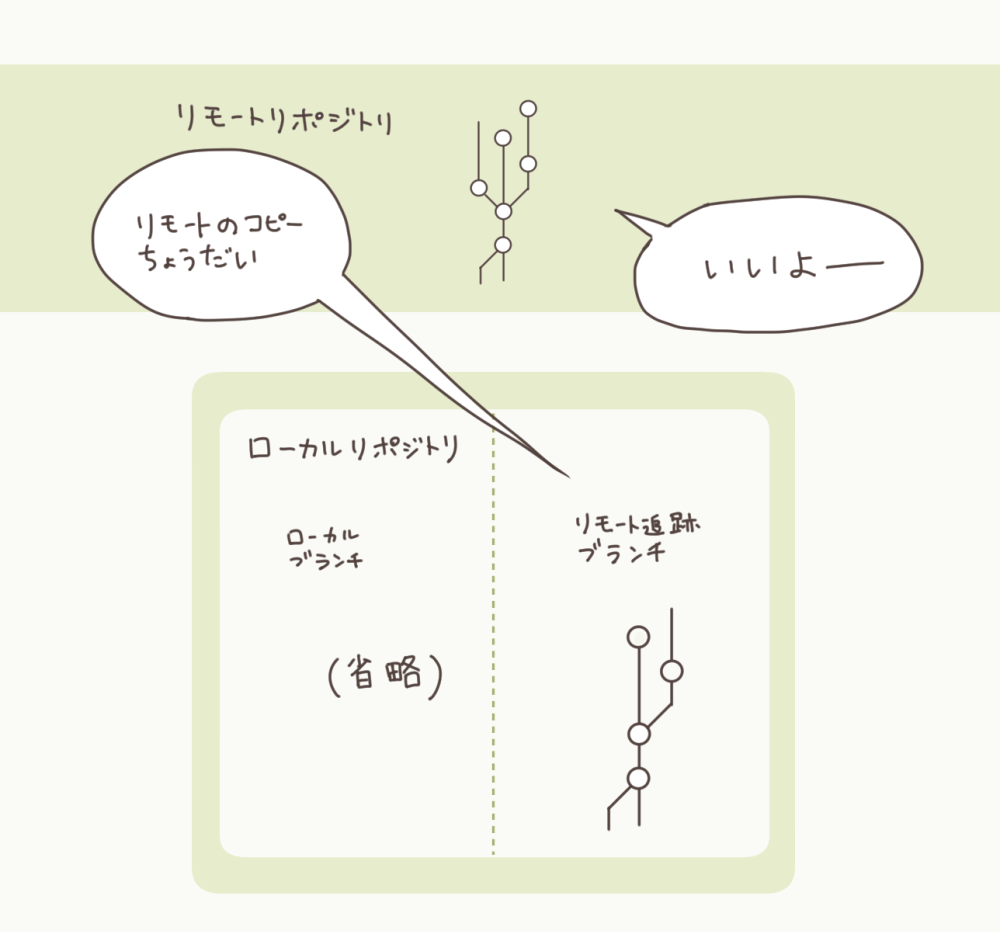
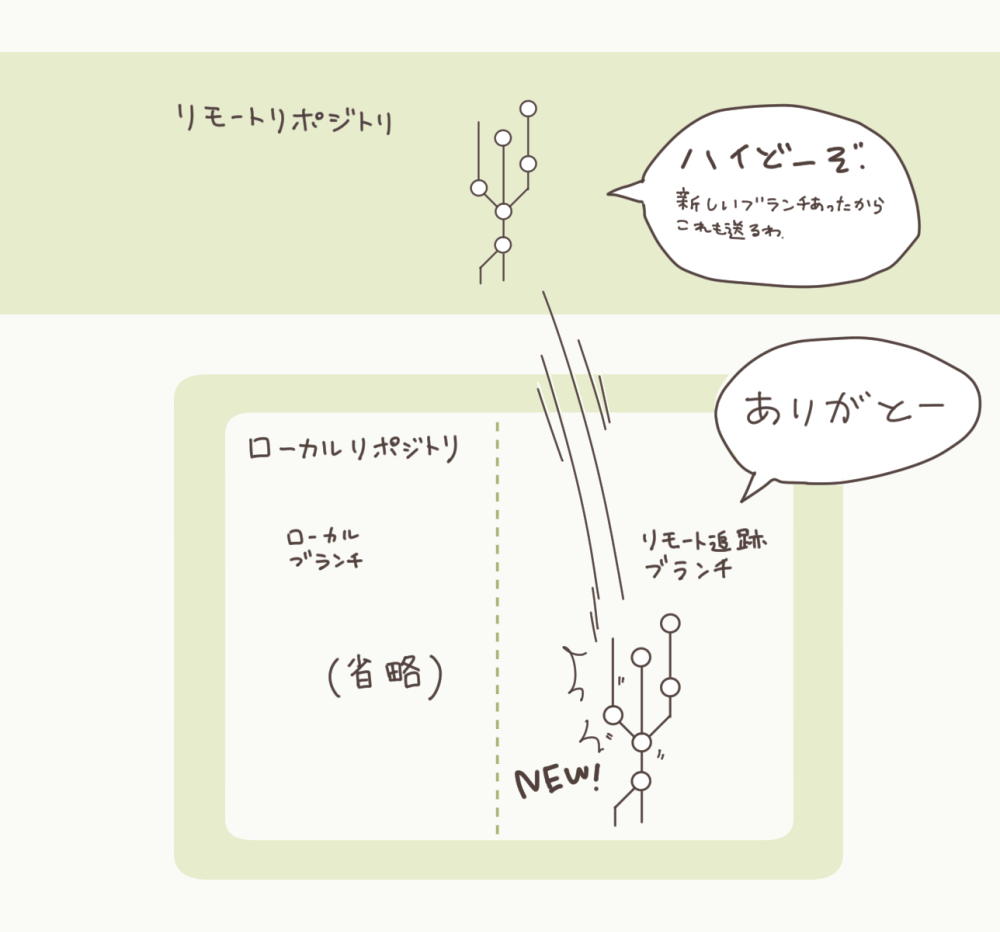
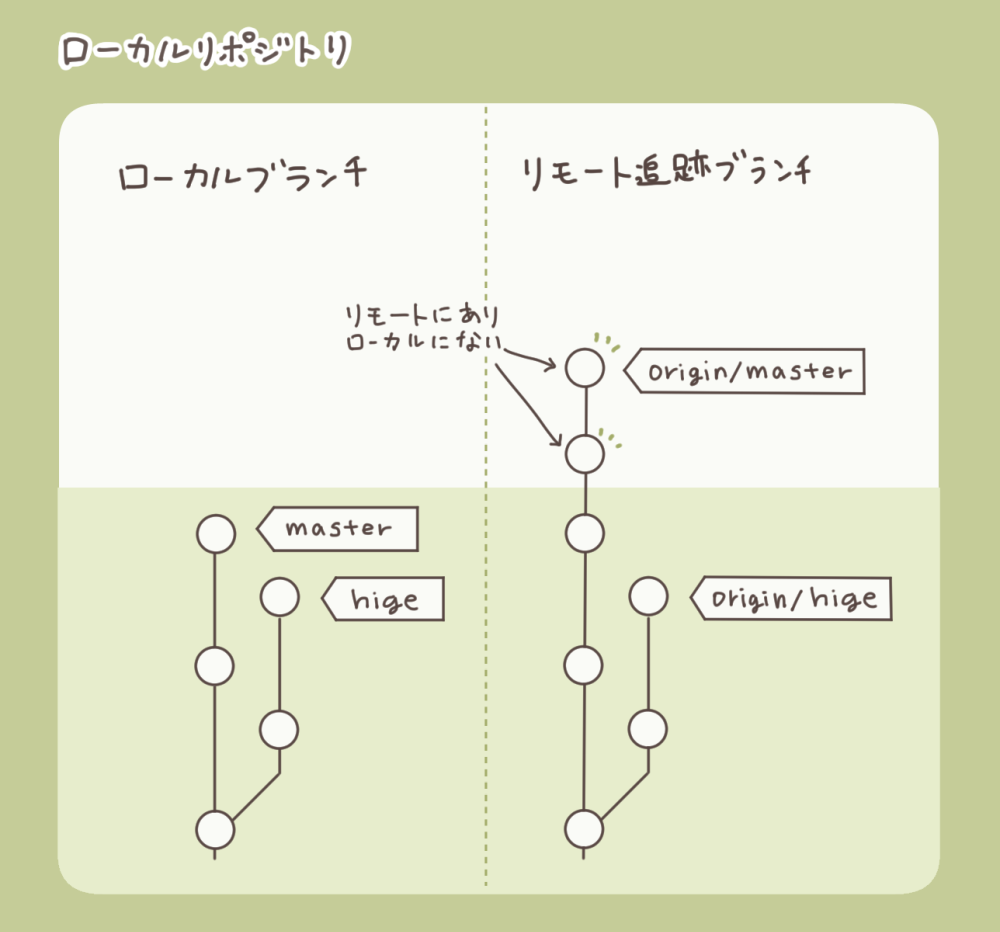
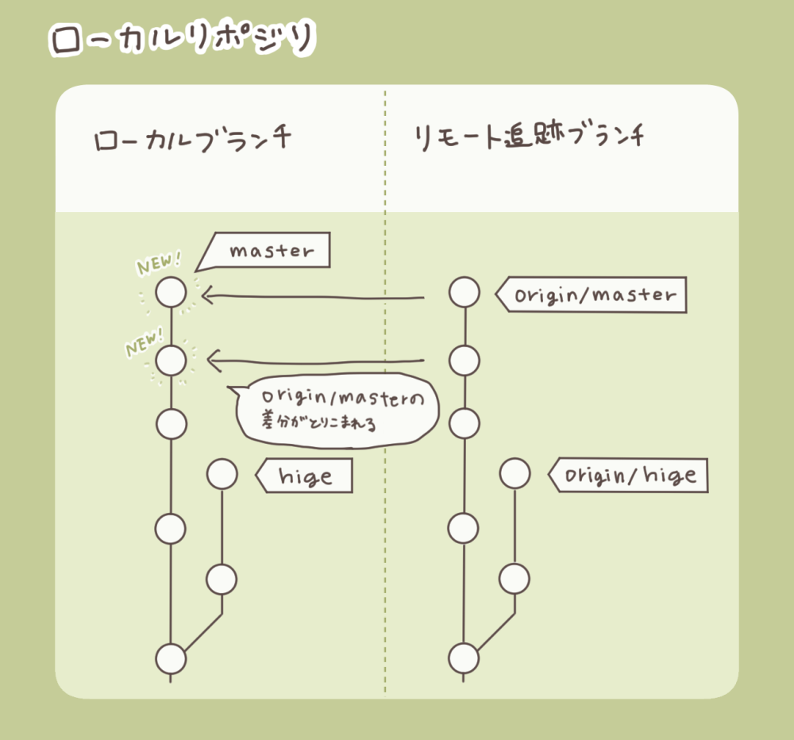

# 研究者のためのGitHub入門
#### 〜ジャグリングみたいな危うい文書管理とオサラバ〜

---

## 今日のゴール

- 基本のコマンドadd、commit、pushを使える
- 雑魚い文書管理の仕方を見た時に
素直に「**Gitでやらないか？**」を言える

---

## 目次
- Gitとは
- Gitの導入
- GitHubとは
- GitHubの導入
- 個人演習
- ワンポイントGit
- 集団演習
- 終わりに

---

## Gitとは（5分）

---

### Gitの正体
- ファイルの**変更履歴を記録・管理**する仕組み
- WordやPDFそのものではなく  
  「**どこがどう変わったか**」を記録する

---

### なぜGitが必要か

- よくある問題
  - 論文_最終、論文_最終_修正版、論文_最終_本当に最終
  - 資料_20251231、資料_20260103、資料_20260111
  →ファイル数が膨大！
  →ファイル名の情報は本当？
  　資料_20251231を最後に編集したけど名前変え忘れ...

---

### なぜGitが必要か

- Gitが解決すること
  - 変更履歴が自動で残る
  - 誰がいつ何を変えたか分かる
  - いつでも過去に戻れる

---

### Gitで「できない」こと

- ファイルの自動編集はしない
- 同時編集の衝突は自動では完全に解決できない
- だからこそ**人間の判断を尊重する設計**

---

## Gitの導入（5分）

<div class=comment>パソコンを用意せよ！</div>

---

### インストール
- Windows / macOS / Linux すべて対応
- 公式サイトからインストール

<div class=comment>もう入ってるやつはしばらく待ちで</div>

---

### 導入確認

```bash
git --version
```

- バージョンが表示されればOK
- エラーが出たらまだ使えない

---

## GitHubとは（5分）

---

### GitHubの正体
- **Gitの履歴を置いておくネット上の保管庫**
- Git ≠ GitHub

<div class=comment>何かがあつまるところのことをハブっていうよね〜（語源は車輪の軸）</div>

---

### GitHubでできること

- クラウド上のバックアップ
- 複数人での共同編集
- 変更履歴の可視化
- ブラウザ・スマホから閲覧可能

---

### GitHubを使う理由（研究者向け）

- メールでのファイル往復が不要
- 共著者の変更が一目で分かる
- 「最新版はどれ？」がなくなる

---

## GitHubの導入（10分）

---

### アカウント作成
- メールアドレスがあればOK
- 無料プランで十分

---

### 超最低限の概念

- **リポジトリ** = プロジェクト用フォルダ
- GitHub上に存在する「**書庫**」

<div class=comment>"俺のGitHubリポジトリ"に全部のファイル入れると散らかるからやめとけ</div>

---

## 個人演習（20分）

---

### 個人演習でやること
- ①ローカルでGitを触る
  - <span class=forgetable>init(gitに仕事を始めさせる)</span>
  - add(確定したい変更内容を追加)
  - commit(変更内容を確定)
  - <span class=forgetable>configでユーザー名とメアド設定</span>

<div class=comment>灰色の項目はたまにしか使わないから忘れていいよ</div>

---

### 個人演習でやること
- ②GitHubにアップロード(通称：push)する
  - <span class=forgetable>空のリポジトリ(保存場所)を作る</span>
  - <span class=forgetable>remoteでリポジトリと紐付け</span>
  - push(アップロード)する
  - <span class=forgetable>GitHubでPAT(鍵)を生成する</span>
  - <span class=forgetable>PATを入力する</span>

<div class=comment>灰色の項目はたまにしか使わないから忘れていいよ</div>

---

### git init

```bash
git init
```

- このフォルダを「履歴管理対象」にする
- まだGitHubとはつながっていない

<div class=comment>「おいGit、このフォルダよく見ておけ」</div>
<div class=comment>Git「承知でやんす」</div>


---

### git status

```bash
git status
```

- 今どういう状態かを見るコマンド
- 迷ったらまずこれ
<div class=summary>出てきた結果をChatGPTに貼るとどういう状態か教えてくれるから解読する必要は極論、なし</div>

---

### GitHubと紐付け

```bash
git remote add origin https://github.com/<user>/<repo>.git
```

---

### add / commit / push の流れ

- **add**  
  - 記録したい変更を選ぶ
- **commit**  
  - 変更を履歴として確定
- **push**  
  - GitHubに送信（バックアップ）

---

### add / commit / push のコマンド

- add
```bash
git add .
```
- commit
```bash
git commit -m "この変更のタイトルとか書く"
```
- push
```bash
git push origin main
```

---

### add / commit / push の比喩

- add：弾丸を装填
- commit：撃鉄を起こす
- push：GitHubに向けて打つ！→命中！

---

### リポジトリを作る
がんばれ

---

### add commit pushしてみよう
やってみろ。初めての人はpushで止まると思う。

---

### PATが必要
- PATとは
パーソナルアクセストークン。要するに鍵。消費期限を設定できる。
- 作ってみよう
  - settingsの一番下、developper settingsでクラシックのものを作ろう
  - Expiration(期限)は無期限以外で
  - Select scope(権限)はrepo
  - Generate token(ぽちっとな) 

---

### add commit pushしてみよう(続編)
PAT作った時に出てきた文字列をコピペするとpush可能
<div class=comment>これで基本操作習得完了<br>どんどんpushしていけ</div>

---

### ブランチってなに？

ファイルの状態を枝分かれする機能

- ブランチ = 差分の積み重ね
- ファイルのコピーではない
- とても軽量で安全

<div class=comment>ローゼンメイデンの巻いた世界線と巻かなかった世界線的な？</div>

---



<div class=caption>ブランチの図</div>

---

### ブランチ操作

```bash
git switch -c なんかブランチの名前
```

- ブランチ = 作業用コピー
- 本文を壊さず別案を試せる

---

### マージ

masterブランチをhigeブランチにマージする時
```bash
git switch hige
git merge master
```

- 良かった案を本流に戻す
- 実験ノートの統合に近い

<div class=summary>要するに合体</div>

---


<div class=caption>マージの図</div>

---

## ワンポイントGit（5分）

---

### 突発Gitクイズ！
ブランチと言われているものは何種類ある？
```
① １個
```
```
② ２個
```
```
③ ３個
```

---
<!-- _class: answer -->

正解は３個！


---


<div class=caption>役割の違う三つのリポジトリ</div>

---

### Gitが管理している3つのブランチ

1. 追跡ブランチ
2. リモート追跡ブランチ
3. リモートブランチ

---

### commit / push の本質

- commit：作業内容　→　ローカルブランチに反映
- push：ローカルブランチ　→　リモート追跡ブランチ、リモートブランチ

---

### GitとGitHubの関係

- Gitはオープンソース
- GitHubはGitを使ったサービス
- 依存関係ではない

---

### GitHubの容量制限

- 1ファイル最大100MB
- リポジトリで５GBをを超えると警告

<div class=summary>大容量データは不向き<br>実験データ・画像大量保存は注意</div>
<div class=comment>GitHubは無制限に使えるオンライン保存場所ではない</div>

---


---

## ここまでの大事なことまとめ
- Gitはフォルダの変更を監視してくれる
- GitHubを使い始めるときは結構めんどい
- 基本のコマンドadd、commit、pushでGitHubにアップロードできればOK

---

## 集団演習（60分）

---

### 演習の設定

この資料が置かれているのと同じGitHubのリポジトリにスキー旅行計画フォルダがある。
そこを編集してスキー旅行計画を完成させよう。

- テーマ：スキー旅行の計画
- 役割分担して編集
- 実際の共同研究を想定

<div class=comment>とにかくやってみろ</div>

---

### 謎の拡張子.mdって何？

Markdownという書き方の拡張子
GitHub上で開くとほら、綺麗に見えるでしょ

<div class=comment>難しく考えるな。ノリで書け。</div>

---

### clone

```bash
git clone <URL>
```

- GitHub上のファイルを手元にコピー
- 最初に必ず行う操作

---

### ブランチ運用ルール

- mainは直接編集しない
- 作業は作業用ブランチでやる

<div class=comment>自分専用の場合は関係ないぞ</div>

---

### Pull Request（通称：プルリク、PR）

- プルリク = 査読
- 変更内容を共有・議論する場
- いきなり混ぜないための仕組み
<div class=summary>「殺人は今日から無罪にしました」<br>「エッ！？議論とかは…？」<br>「してないです。もう反映されてます」<br>　→　困る…！</div>
<div class=comment>プルリクはレビューの結果修正の必要が出ることもしばしば</div>

---

### fetch と pull

- fetch  
  - 相手の進捗を取得（反映しない）
  - リモートブランチ　→ リモート追跡ブランチ
- pull  
  - 取得＋自分の作業に反映
  - リモートブランチ　→ リモート追跡ブランチ、ローカルブランチ

---


<div class=caption>fetchのとき</div>

---


<div class=caption>fetchのとき</div>

---


<div class=caption>pullした場合は<br>fetchの処理に加えて</div>

---


<div class=caption>pullした場合は<br>fetchの処理に加えて</div>

---

### コンフリクトとは

- Gitが自動で判断できない状態
- 同じ場所を複数人が変更したとき発生

---

### コンフリクト解消

Gitは判断できないので人間が判断して編集する必要あり

- 内容を確認
- 正しい文章を選択・修正
- commitして完了

---

### 履歴・差分・restore

- 変更履歴は**全て残っている**
- 間違えても元に戻せる
- Git最大の**安心**ポイント

---

## 終わりに（5分）

---

### 重要な考え方

- Gitは「壊さないための仕組み」
- 失敗しても一度commitした作業内容・ファイルが消える、壊れる、と言うことは絶対にない

---

### .gitignore

- 一時ファイルを記録しない
- Wordの自動生成ファイル対策
- 事故防止の基本

<div class=summary>ゴミファイルやセキュリティ上問題のあるファイルをGitの管理下から外す仕組み</div>

<div class=comment>上級テク。研究者はそんなに使わないかもな〜</div>

---

### コマンドについて

- 全部覚える必要はない
- やりたいことを言語化すればよい
- 都度**ChatGPTに聞けば十分**

---

### 最後の注意

- **リポジトリ削除は慎重に**
- 消すと基本的に戻らない

<div class=comment>消す必要は多分ないんじゃないかな</div>

---

## お疲れさまでした

Gitの門は開かれた。蹂躙せよ。